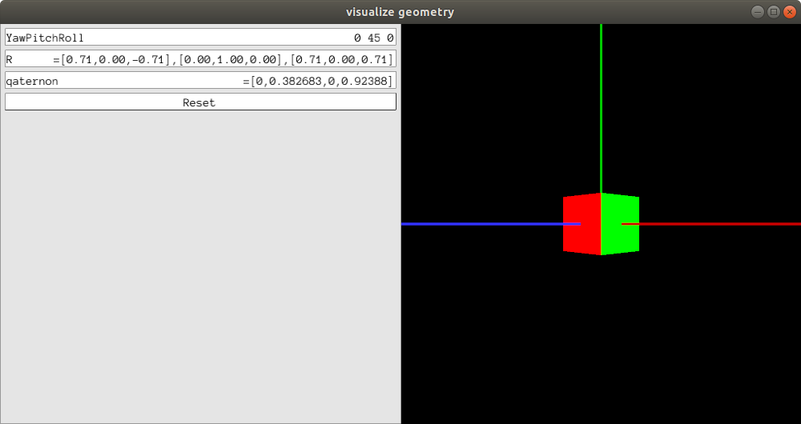

# About

Calculate and visualize Quaternion and Rotation matrix using Euler Angle (yaw, pitch, roll).

# How to use

## Requirement

- Pangolin
- Eigen

## Compile

```sh
mkdir build
cd build
cmake ..
make
```

## RUN

- Run ``./main``

- Input Yaw, pitch and roll use keyboard
    - yaw: Z-axis   (Blue)
    - pitch: Y-axis (Green)
    - roll: X-axis (Red)

- Output: Quaternion and Rotation matrix

- Visualize use Pangolin

# Demo


